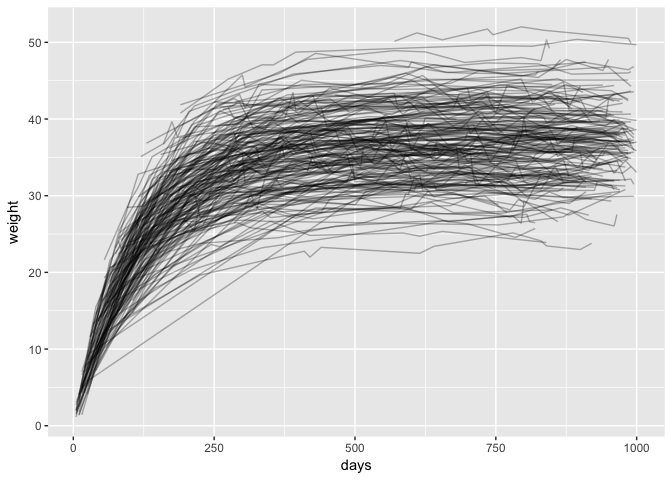

Growth Curves and gamlss()
================
Ian Handel
31/10/2017

Simulate some growth curves
---------------------------

``` r
N <- 200
dat <- tibble(id = 1:N,
              rates = rnorm(N, 0.01, 0.001),
              assym = rnorm(N, 37, 5)) %>% 
  inner_join(as_tibble(expand.grid(id = 1:N,
                                   days = seq(5, 1000, 5))),
             by = "id") %>% 
  mutate(weight = assym * (1 - exp(-days * rates)) + rnorm(nrow(.), 0, 1)) %>% 
  sample_frac(0.05)
```

Plot them
---------

``` r
ggplot(dat, aes(x = days, y = weight, group = id)) +
  geom_line(alpha = 0.3)
```



Now fit model
-------------

``` r
mod <- nlgamlss(y = weight,
                mu.formula = ~ A * (1 - exp(- days * B)),
                sigma.formula = ~ 1,
                data = dat,
                family = NO,
                mu.fix = FALSE,
                sigma.fix = FALSE,
                mu.start = c(100, 0.1),
                sigma.start = 10)

summary(mod)
```

    ## *******************************************************************
    ## Family:  c("NO", "Normal") 
    ## 
    ## Call:  nlgamlss(y = weight, mu.formula = ~A * (1 - exp(-days * B)),  
    ##     sigma.formula = ~1, data = dat, family = NO, mu.fix = FALSE,  
    ##     sigma.fix = FALSE, mu.start = c(100, 0.1), sigma.start = 10) 
    ## 
    ## Fitting method: "JL()" 
    ## 
    ## -------------------------------------------------------------------
    ## Mu link function:  identity
    ## Mu Coefficients:
    ##     Estimate  Std. Error  t-value  p-value
    ## A  36.853335   0.1370027   269.00        0
    ## B   0.009686   0.0002335    41.48        0
    ## 
    ## -------------------------------------------------------------------
    ## Sigma link function:  log
    ## Migma Coefficients:
    ##              Estimate  Std. Error  t-value  p-value
    ## (Intercept)      1.55     0.01584    97.83        0
    ## 
    ## -------------------------------------------------------------------
    ## No. of observations in the fit:  2000 
    ## Degrees of Freedom for the fit:  3
    ##       Residual Deg. of Freedom:  1997 
    ##                       at cycle:  39 
    ##  
    ## Global Deviance:     11874.95 
    ##             AIC:     11880.95 
    ##             SBC:     11897.75 
    ## *******************************************************************
